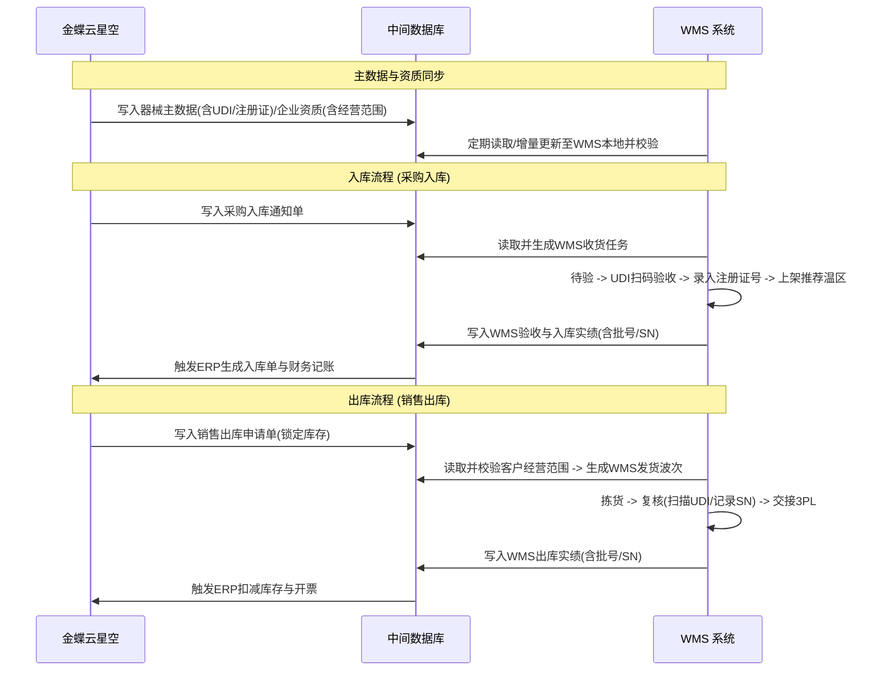
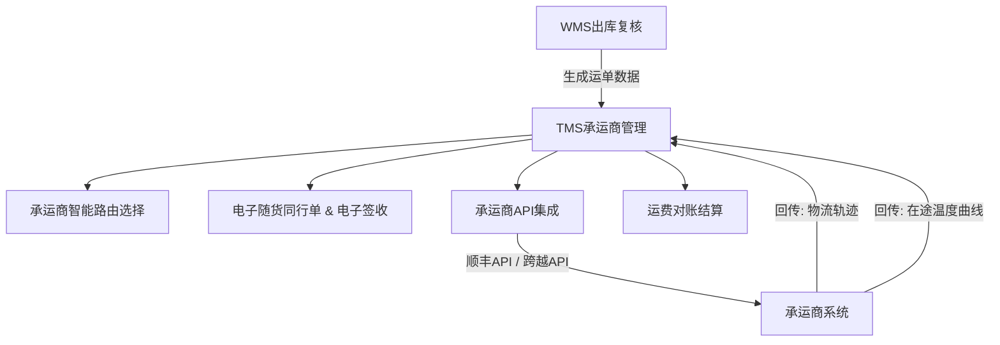

# 符合医疗器械 GSP 规范的 WMS 与 3PL-TMS 系统规划方案

本项目首期将建设一套**符合医疗器械 GSP 规范**的仓储管理系统（WMS），并支持与金蝶云星空 ERP 系统对接，同时为后期无缝扩展第三方物流（3PL）运输管理系统（TMS）提供系统性的规划与架构设计。

---

## 一、 医疗器械 GSP 合规性核心要求规划

医疗器械品类繁多、跨度巨大（从耗材、体外诊断试剂到大型设备），系统必须围绕**“分类管理、全程可追溯（UDI）、经营范围卡控”**进行设计。

### 1. 唯一标识（UDI）与序列号（SN）全流程追溯
* **UDI 自动解析**：系统必须集成 UDI 解析引擎（支持 GS1、连接/康码等主流标准），扫描 UDI 条码时，自动拆分出 **DI**（产品标识）和 **PI**（生产标识，包含生产批号、有效期、序列号等）。
* **批次与单件（SN）追踪**：
  * 对普通耗材和体外诊断试剂，采用**批号+效期**级管理。
  * 对植入类、有源类等第三类高风险医疗器械，系统必须实行**单件序列号（SN）强追踪**，记录每个独立器械从入库验收、在库、出库复核到最终交付的全生命周期轨迹。

### 2. 采购/销售经营范围的系统性卡控
* **企业与器械资质绑定**：系统需维护供应商和客户的《医疗器械经营许可证/备案凭证》，并细化到**器械分类目录（如一类、二类、三类及具体分类代码，如6846）**。
* **准入强拦截（核心）**：
  * **采购入库**：如果供应商的许可证中没有该器械分类，或者该器械的《医疗器械注册证/备案凭证》已过期，WMS 拒绝收货。
  * **销售出库**：如果客户（医院或下游商业）的经营范围未包含出库器械的分类代码，WMS 必须在波次分配或拣货环节强制拦截，禁止发货。

### 3. 多温区与特殊储存条件管理
* **温区分布**：常温、阴凉、冷藏（2-8℃，如体外诊断试剂）、冷冻（如某些生物试剂）、超低温（如特定活性样本/试剂）。
* **特殊环境标识**：部分器械有防磁、防尘、防静电、避光或垂直放置要求，WMS 货位分配策略必须支持这些特殊保管条件的约束，避免混放。
* **温湿度联动锁定**：针对冷藏/冷冻/超低温区，WMS 对接温湿度监控 API。当温湿度发生超限预警时，系统自动锁定对应库区的库存，防止未经验证的温升器械出库。

### 4. 计算机系统验证与审计追踪 (Audit Trail)
* **不可逆日志**：系统必须记录所有影响库存状态、质量状态、关键业务节点的操作（如：验收判定、不合格锁定、资质人工覆盖授权等），记录包含“Who, When, What, Why”，且数据库底层不允许物理删除。
* **电子签名**：对验收不合格确认、不合格器械销毁等关键质量环节，需支持双人复核或电子签名确认。

---

## 二、 系统集成架构 (金蝶云星空中间库对接)

WMS 与金蝶云星空 ERP 通过中间库进行数据交互，确保业务流与质量控制流的统一。

### 1. 中间库数据模型规划
* **主数据接口表**：
  * `t_md_material` (器械主数据)：包含医疗器械分类（一/二/三类）、分类目录代码、注册证号/备案凭证号及有效期、是否启用 SN 管理、温区要求、特殊储存要求。
  * `t_md_partner` (往来单位资质)：记录客户/供应商的《医疗器械经营许可证》及其允许经营的器械分类代码列表（如 6846, 6815 等）。
* **业务单据接口表**：
  * `t_bill_in_notify` (入库通知表) & `t_bill_in_result` (入库结果反馈表，回传批号、SN、验收结论)。
  * `t_bill_out_notify` (出库通知表) & `t_bill_out_result` (出库结果反馈表，回传出库的具体 UDI、批号、SN)。

---

## 三、 TMS 扩展规划：委托三方物流 (3PL) 协同模式

由于运输完全外包，TMS 系统的重心是**“承运商资质卡控、电子随货同行、在途温度追踪、运费自动对账”**。

### 1. 承运商资质与委托协议管理 (GSP 合规)
* **资质审核**：TMS 需维护第三方物流商的**医疗器械运输资质、冷链验证报告、委托运输协议**及有效期。
* **出库卡控**：若承运商资质过期，WMS 在进行出库装车交接时，禁止选择该承运商。

### 2. 顺丰与跨越 API 深度集成
针对顺丰（SF）和跨越速运（KY），TMS 需要对接其开放平台接口：
* **自动下单与面单打印**：
  * WMS 出库复核完毕后，TMS 自动调用顺丰/跨越的下单 API，获取**快递单号（Waybill Number）**及电子面单数据。
  * WMS 工作台直接打印顺丰/跨越的电子面单，贴签包装。
* **在途轨迹跟踪 API**：
  * TMS 订阅顺丰/跨越的路由轨迹推送（Webhook），自动记录每个节点的签收状态，并将其与 WMS 发货单关联。
* **冷链在途温度追溯 (针对体外诊断试剂等冷链器械)**：
  * **顺丰冷链**：通过 API 自动抓取顺丰系统中的在途温度数据，并在系统内生成完整的在途温度曲线。
  * **跨越冷链/物理记录仪**：对未提供温度 API 的冷链运输，支持在 TMS 签收环节上传物流商导出的温度记录文件（CSV/PDF），并与出库单绑定。

### 3. 电子随货同行单与交接
* **医疗器械随货同行单**：随货同行单必须包含医疗器械通用名、规格、批号、有效期/失效期、生产企业、注册证号/备案凭证号、收货单位、发货日期等。
* **3PL 交接记录**：系统需记录交接人员、接收人员、交接时间、交接时温度（针对冷链）、保温箱编号等，并支持打印带有条码的交接清单。

---

## 四、 实施路线图建议

| 阶段 | 核心任务 | GSP 与技术合规重点 | 预计周期 |
| :--- | :--- | :--- | :--- |
| **第一阶段：接口与对接设计** | 设计中间库表结构，配置金蝶云星空的同步逻辑；**编写温湿度监控 API 接口规范**；设计 UDI 解析逻辑。 | 确立器械注册证及客户经营范围（分类目录）在中间库的准入拦截逻辑。 | 3 - 4 周 |
| **第二阶段：多温区WMS研发** | 开发多温区限制上架算法、批号/SN 锁定逻辑、调用温湿度系统 API 服务。 | 完成 UDI 扫码验收与出库复核、SN 追溯链条和先产先出（FEFO）功能。 | 8 - 10 周 |
| **第三阶段：WMS 验证与上线** | 系统联调，进行**计算机系统验证 (CVS)**，出具验证报告，系统正式投产。 | 模拟注册证过期拦截、超范围经营拦截、冷链断链超温锁定等合规性验证。 | 4 周 |
| **第四阶段：TMS 3PL 协同模块开发** | 对接**顺丰与跨越打单、轨迹 API**；实现在途温湿度数据关联与交接单管理。 | 建立完整的 3PL 交接记录及在途温度曲线关联，确保冷链链条完整。 | 4 - 6 周 |
| **第五阶段：一体化优化与结算上线** | 联调 WMS 交接与 TMS 3PL 数据流；上线运费核销对账模块。 | 实现从采购收货到销售出库，再到 3PL 派送的一键式全生命周期溯源。 | 3 周 |
