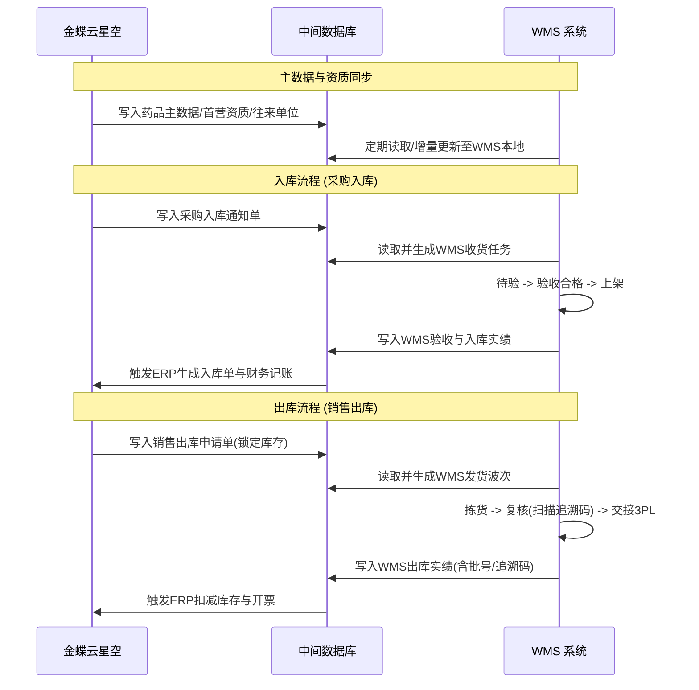
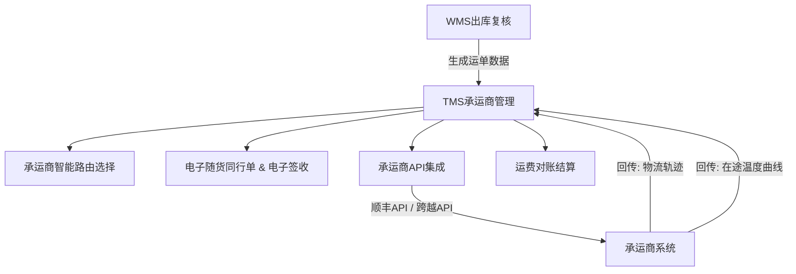

# 符合 GSP 规范的 WMS 与 3PL-TMS 系统规划方案

本项目旨在建设一套符合《药品经营质量管理规范》（GSP）要求的仓储管理系统（WMS），并支持与金蝶云星空 ERP 系统对接，同时为后期无缝扩展第三方物流（3PL）运输管理系统（TMS）提供系统性的规划与架构设计。

---

## 一、 系统集成架构 (金蝶云星空中间库对接)

通过中间库进行解耦，可降低 WMS 与 ERP 的直接耦合度，提高数据传输的稳定性和容错能力。

### 1. 中间库数据模型规划
* **主数据接口表**：
  * `t_md_material` (物料主数据)：包含 GSP 核心属性（批准文号、生产企业、剂型、规格、温区属性、养护周期）。
  * `t_md_partner` (客户/供应商资质)：记录客户/供应商的 GSP 经营许可证、营业执照及有效期。WMS 必须控制**资质过期禁止收发货**。
* **业务单据接口表**：
  * `t_bill_in_notify` (入库通知表) & `t_bill_in_result` (入库结果反馈表)。
  * `t_bill_out_notify` (出库通知表) & `t_bill_out_result` (出库结果反馈表)。
* **防脏读与事务控制**：
  * 引入状态字段（`sync_status`：0-待同步，1-同步中，2-同步成功，3-同步失败）和错误日志字段。
  * WMS 对中间库表进行轮询或通过事件通知，读取后立即更新状态，避免重复读取。

---

## 二、 多温区与 GSP 质量卡控设计

本项目涵盖了常温、阴凉、冷藏、冷冻、超低温五个温区，GSP 验证（计算机系统验证 CVS）在此是绝对的重难点。

### 1. 严格的温区逻辑与物理卡控
* **库区属性绑定**：在 WMS 系统中，对各货位（Location）绑定明确的温区属性：
  * 常温区 (10℃ - 30℃)
  * 阴凉区 (0℃ - 20℃)
  * 冷藏区 (2℃ - 8℃)
  * 冷冻区 (-18℃ 至 -25℃)
  * 超低温区 (如 -80℃ 设备)
* **上架逻辑硬控制**：当收货验收完成后，系统在计算推荐上架货位时，**必须且仅能**匹配该药品主数据中要求的温区。如果人工修改至不匹配 the 温区，系统必须硬性拦截并报错。
* **超低温特有流程**：超低温药品（如某些生物制品、疫苗）在库停留时间有极严格的限制。系统需要记录**出库开箱到入库锁闭的时间差**，超出时限需自动触发质量预警。

### 2. GSP 冷链收货验收规范
* **冷链车辆温度核验**：冷藏/冷冻药品到货时，WMS 验收界面强制要求录入冷藏车车牌、启运温度、到货温度、在途运行时间、在途温度记录仪序列号。
* **温度记录上传**：系统需支持上传第三方承运商提供的 PDF 温度轨迹报表，与验收单据进行强绑定关联。

### 3. 温湿度系统 API 抽象设计
为了避免 WMS 直接直连温湿度监测系统的底层数据库，将其抽象为 Web API 接口是最佳实践。

WMS 主要调用以下 API 端点：
* **实时温湿度查询 API**：
  * `GET /api/v1/monitor/realtime?areaCode=xxx`
  * 返回当前库区/货位的实时温度、湿度、电量等。
* **历史温湿度曲线 API**（生成 GSP 记录及备查）：
  * `GET /api/v1/monitor/history?areaCode=xxx&startTime=xxx&endTime=xxx`
  * 返回特定时间范围内的温湿度数据列表（用于在库养护记录）。
* **温湿度异常报警推送 (Webhook/API)**：
  * 温湿度系统监控到超限时，主动调用 WMS 的 `POST /api/v1/wms/alarm` 接口。
  * **WMS 收到报警后的响应**：自动冻结异常库区的所有货位库存，状态转为“待验库锁定”。

---

## 三、 TMS 扩展规划：委托三方物流 (3PL) 协同模式

由于运输完全外包，TMS 系统的重心不是“运力调度和路线优化”，而是**“承运商资质卡控、电子随货同行、在途温度追踪、运费自动对账”**。

### 1. 承运商 GSP 资质准入 (核心合规点)
* **资质审核**：TMS 需维护第三方物流商的**冷链运输资质、车辆验证报告、车载保温箱验证报告**及有效期。
* **超期卡控**：若承运商资质过期，WMS/TMS 在进行出库装车交接时，禁止选择该承运商。

### 2. 顺丰与跨越 API 深度集成
针对顺丰（SF）和跨越速运（KY），TMS 需要对接其开放平台接口：
* **下单与打单接口**：
  * WMS 出库复核完毕后，TMS 自动调用顺丰/跨越的下单 API，获取**快递单号（Waybill Number）**及电子面单数据。
  * WMS 工作台直接打印顺丰/跨越的电子面单，贴签包装。
* **在途轨迹跟踪 API**：
  * TMS 订阅顺丰/跨越的路由轨迹推送（Webhook），或者定时轮询轨迹。
  * 自动记录每个节点的签收状态，并将其与 WMS 发货单关联。
* **冷链在途温度追溯 (重点：顺丰医药)**：
  * 对于顺丰冷链/医药配送，顺丰提供冷链在途温度 API。TMS 在包裹签收后，通过 API 自动抓取并存储该单在途的温度曲线数据。
  * 对于跨越速运，若提供冷链服务，对接其温度接口；若采用物理记录仪，支持在 TMS 签收环节录入/上传温度记录仪数据。

### 3. 电子随货同行单与交接
* **GSP 随货同行单**：随货同行单必须包含药品通用名、规格、批号、有效期、生产企业、收货单位、发货日期等。
* **3PL 交接记录**：系统需记录交接人员、接收人员、交接时间、交接时温度、保温箱编号等，并支持打印带有条码的交接清单。

### 4. 费用结算（3PL 对账）
* **计费引擎**：支持按**重量、体积、件数、区域、温区**（冷链费率通常高于常温）配置复杂的承运商费率模板。
* **自动对账**：WMS 出库完成后，TMS 自动计算理论运费。月末导入承运商账单，系统自动对账，标出差价超限的单据，提高财务审核效率。

---

## 四、 实施路线图建议

| 阶段 | 核心任务 | GSP 与技术合规重点 | 预计周期 |
| :--- | :--- | :--- | :--- |
| **第一阶段：接口与对接设计** | 设计中间库表结构，配置金蝶云星空的同步逻辑；**编写温湿度监控 API 接口规范**；申请顺丰与跨越的沙箱账号。 | 保证首营资质、物料温区属性在中间库的准确流转。 | 3 - 4 周 |
| **第二阶段：多温区WMS研发** | 开发多温区限制上架算法、批号/效期锁定逻辑、调用温湿度系统 API 接收服务。 | 完成 GSP 验收界面设计、FEFO 自动分配和批次追踪功能。 | 8 - 10 周 |
| **第三阶段：WMS 验证与上线** | 系统联调，进行**计算机系统验证 (CVS)**，出局验证报告，系统正式投产。 | 模拟温差超限自动锁定、资质过期拦截、先产先出等控制点验证。 | 4 周 |
| **第四阶段：TMS 3PL 协同模块开发** | 对接**顺丰与跨越打单、轨迹 API**；实现在途温湿度数据关联。 | 建立完整的 3PL 交接记录及在途温度曲线关联，确保冷链链条完整。 | 4 - 6 周 |
| **第五阶段：一体化优化与结算上线** | 联调 WMS 交接与 TMS 3PL 数据流；上线运费核销对账模块。 | 实现从采购收货到销售出库，再到 3PL 派送的一键式全生命周期溯源。 | 3 周 |
