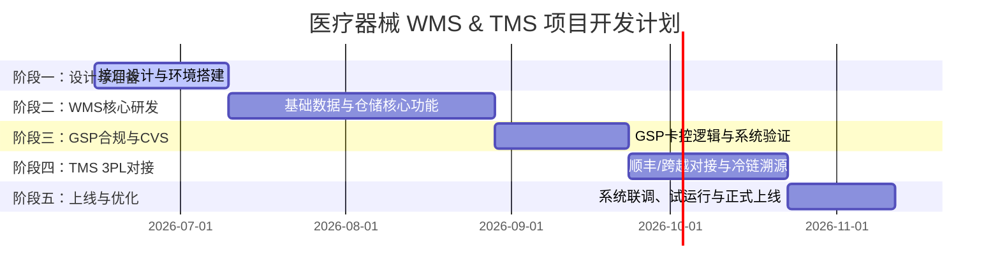

# 医疗器械 GSP WMS & TMS 系统开发实施计划

本开发计划基于“符合医疗器械 GSP 规范的 WMS 与 3PL-TMS 系统规划”制定，明确了项目里程碑、开发任务拆解、责任分工及交付物。

---

## 📅 项目里程碑与总体排期

项目整体预计周期为 **18 - 22 周**，分为 5 个核心阶段：

---

## 🛠 详细开发任务拆解

### 阶段一：接口设计与技术准备 (第 1 - 4 周)
* **任务 1.1：金蝶中间库对接设计与验证**
  * 共同梳理并确定中间库表（主数据表、出入库单据表）字段。
  * 编写 WMS 端的轮询/事件同步服务（处理状态防脏读）。
* **任务 1.2：UDI 条码解析服务开发**
  * 遵循 GS1 标准与国家医保局编码标准，开发 UDI 扫码解析组件（拆分 DI 与 PI，提取物料编码、批号、生产日期、有效期、序列号 SN）。
* **任务 1.3：温湿度系统 API 规范定义**
  * 定义 WMS 接收温湿度数据的标准 RESTful API，并为第三方温湿度厂商提供推送 Webhook 规范。

### 阶段二：WMS 核心业务功能研发 (第 5 - 12 周)
* **任务 2.1：基础主数据与货位管理**
  * 支持多仓、多货主、多温区（常温/阴凉/冷藏/冷冻/超低温）。
  * 货位属性增加特殊标识（防磁、防静电、避光、直立）。
* **任务 2.2：入库业务流 (收货 -> 验收 -> 上架)**
  * 开发 **GSP 验收工作台**（记录随货同行单、注册证号、冷链车辆信息、在途温度报表，支持验收拍照）。
  * 开发**上架推荐策略**（根据器械主数据的温区属性，强制限制只能上架到匹配的库区货位）。
* **任务 2.3：在库管理 (盘点、移库、锁闭)**
  * 支持按货位、商品、批次、单个 UDI 序列号进行锁定。
  * 盘点调整单审批流程与差异原因强制录入（GSP 审计追踪要求）。
* **任务 2.4：出库业务流 (波次 -> 拣货 -> 复核 -> 交接)**
  * 引入 **FEFO（近期先出）** 自动分配算法。
  * 开发 **出库复核工作台**：扫描 UDI 装箱，强制记录高风险器械的唯一 SN 序列号。
  * 打印符合 GSP 规范的**随货同行单**。

### 阶段三：GSP 合规管控与计算机系统验证 (CVS) (第 13 - 16 周)
* **任务 3.1：双向资质准入控制**
  * 供应商与客户医疗器械资质过期自动预警及拦截收发货。
  * 出库时自动核对客户的**经营范围分类代码**，超范围销售强制拦截。
* **任务 3.2：温湿度超限库存锁定联动**
  * 当温湿度报警接口收到异常推送，自动冻结受影响区域的库存状态为“待验/锁定”。
* **任务 3.3：审计追踪与防篡改日志**
  * 关键业务节点（修改资质、盘点调整、人工解锁等）记录不可逆日志，库底层实现只读/追加机制。
* **任务 3.4：计算机系统验证 (CVS)**
  * 编制验证总计划（VMP）、功能规格说明（FS）、安装验证（IQ）、运行验证（OQ）及性能验证（PQ）文档，协助质量部门通过药监局动态/静态核查。

### 阶段四：TMS 3PL 协同与冷链溯源开发 (第 17 - 21 周)
* **任务 4.1：顺丰与跨越 API 深度对接**
  * 对接顺丰/跨越开放平台，实现自动预单、获取快递单号、打印电子面单。
  * 自动订阅并推送运输轨迹（在途、派送、签收）。
* **任务 4.2：冷链全程溯源与交接记录**
  * 对接顺丰医药在途温度 API，或支持跨越冷链记录仪 PDF 文件解析，自动将温度曲线绑定到发货单。
  * 记录 3PL 移交环节（交接人、交接温度、保温箱箱号）。
* **任务 4.3：运费结算与对账引擎**
  * 配置承运商价格模板，实现系统预计运费计算及对账单导入差价核对。

### 阶段五：联调、测试与上线准备 (第 22 周)
* **任务 5.1：系统联调与压力测试**
  * 金蝶中间库同步压力与容错测试。
  * PDA 端高并发扫描性能调优。
* **任务 5.2：用户培训与模拟演练**
  * 仓库实操人员 PDA 扫码、复核培训；质量负责人 GSP 控制台操作演练。
* **任务 5.3：系统正式上线与切换**
  * 期初库存数据导入与校验，正式切单运行。

---

## 👥 角色与责任分工

| 角色 | 关键职责 |
| :--- | :--- |
| **项目经理** | 整体进度管控、跨团队协同（WMS、金蝶ERP团队、温湿度厂商、3PL物流）。 |
| **WMS 后端开发** | 业务逻辑、中间库数据同步、UDI 解析、3PL 接口对接、温控预警 Webhook 研发。 |
| **WMS PDA/前端开发** | 仓库手持 PDA 作业端开发、复核工作台、验收工作台、GSP 合规报表展示。 |
| **金蝶 ERP 实施团队** | 配合设计并维护 ERP 侧的中间库，提供器械主数据和业务单据源头数据。 |
| **质量负责人 (QA)** | 制定 GSP 系统验证标准，主持计算机系统验证 (CVS) 的起草、执行与归档。 |
| **温湿度厂商技术** | 负责按照 WMS 温控规范提供数据推送服务或开放温湿度 API 供 WMS 调用。 |

---

## 📦 项目阶段性交付物

1. **第一阶段**：`《WMS-金蝶中间库接口说明书》`、`《温湿度系统API标准定义》`、`《UDI解析组件源码及用例》`。
2. **第二阶段**：`《WMS 系统详细设计说明书》`、在测试环境部署的 WMS 核心业务版本。
3. **第三阶段**：`《计算机系统验证（CVS）全套报告》`、GSP 合规拦截功能测试用例。
4. **第四阶段**：`《3PL对接（顺丰/跨越）接口文档》`、TMS 在途温度追溯与运费对账模块。
5. **第五阶段**：`《用户操作手册》`、WMS & TMS 生产运行环境系统。
